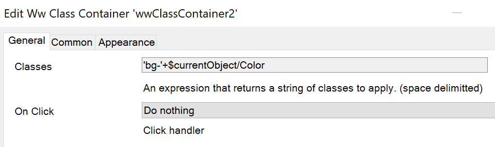

## Front-End Workshop ClassContainer Exercise

This widget is built as part of the Front-End workshop. It features the creation of a container that features an on-click handler and a `class` that's set dynamically based on application data. Topics for discussion include containment, pluggable widget property types, and more.

## Features

The finished product will produce a container with click handler and dynamic class.

## Issues, suggestions and feature requests

